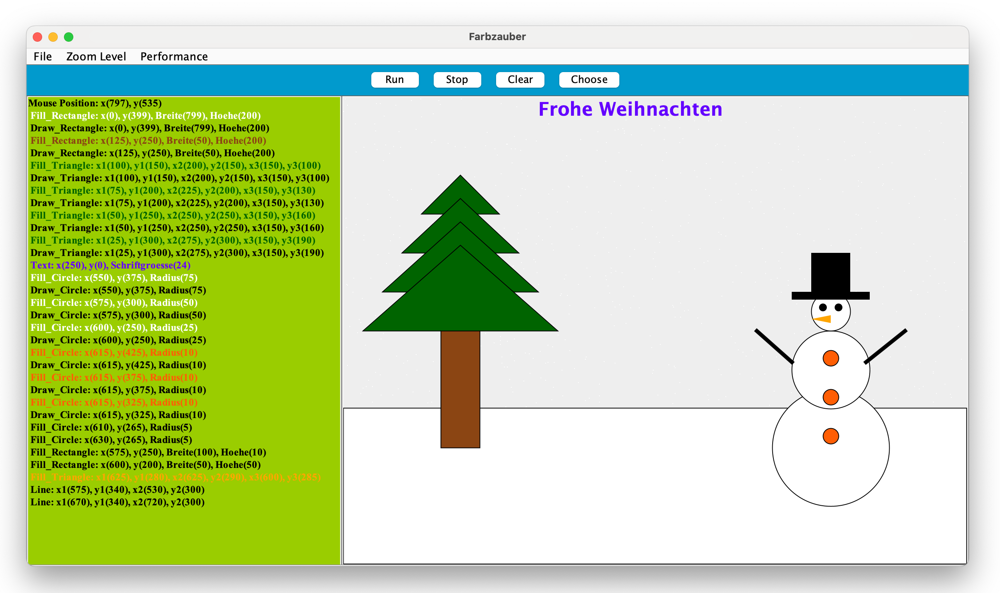

# Farbzauber und Funktionen

Das Kleinprojekt "Farbzauber und Funktionen", entwickelt von Mykyta Skrypnyk, Dennis Seiler und Marcus Rosengart,
entstand als Teilprojekt der Projektgruppe "Programmiererlebnisse" im WS 23/24 an der Hochschule Emden / Leer. </br>
Das Projekt wurde von Prof. Dr. Carsten Link und Frederik Gosewehr, M.Eng. betreut mit dem Ziel
Programmiererlebnisse für Einsteiger zu entwickeln. </br>
Zu diesem Zweck wurde aufbauend auf der Projektarbeit von Nurullah Damla aus dem Jahr 2022, ebenfalls betreut von Prof. Dr. Carsten Link, eine
Swing-Anwendung erweitert und angepasst sowie spezifische Lehrmaterialien und Übungsaufgaben zu erstellt.

## Experimentelle Einführung in die Programmierung

Die Idee für das Kleinprojekt war zunächst ähnliche Übungen einer Aufgabe aus dem Modul C/C++, ebenfalls betreut von Prof. Dr. Carsten Link,
 zu entwickeln, wo Schüler und Erstsemester mithilfe von Programmierstrukturen ein Bild geformt asu ASCII-Zeichen(American Standard Code for Information Interchange)
auf dem Bildschirm ausgeben sollten. Zum Beispiel:
```
SSSSSSSSSS
SSS               SS           SS
SSS               SS           SS
SSS           SSSSSSSSSS   SSSSSSSSSS
SSS               SS           SS
SSS               SS           SS
SSSSSSSSSSS
```
Dieses Grundkonzept ist weitestgehend erhalten geblieben nur, dass die Ausgabe nicht mehr über das Terminal oder einer .txt Datei erfolgt, sondern
in einer überarbeiteten Swing-Anwendung die über das Aufrufen von Funktionen in C++ oder Python das Zeichnen von geometrischen grundformen erlaubt,
freundlicherweise zur Verfügung gestellt von Prof. Dr. Carsten Link.



[Lizenz](LICENSE.md)