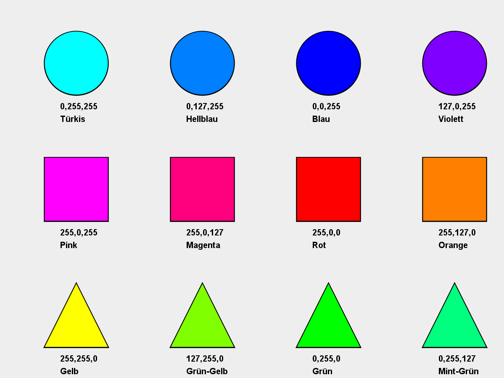
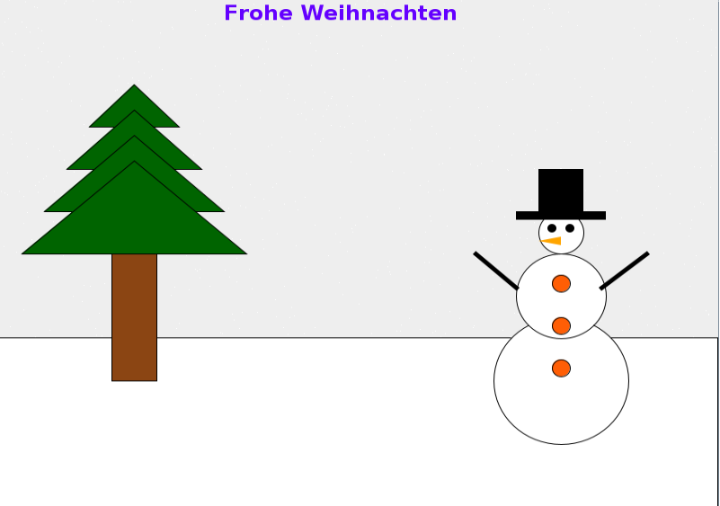
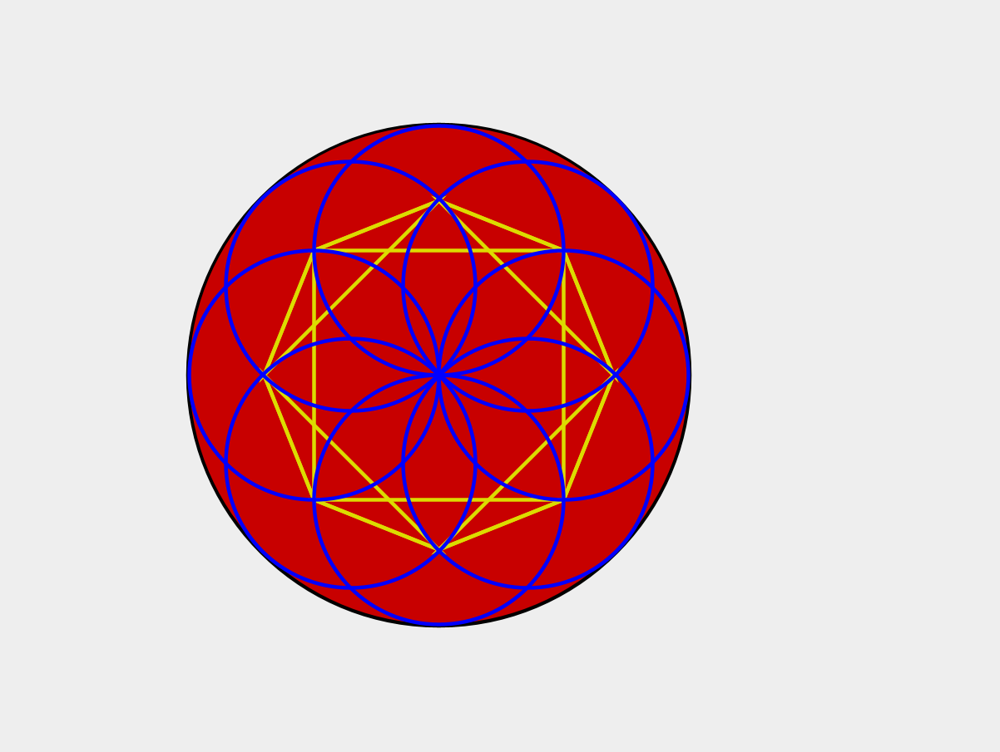

# 1	&nbsp;	Installationsanleitung

Um eine reibungslose Inbetriebnahme der Anwendung zu gewährleisten ist vorher sicherzustellen, dass eine Entwicklungsumgebung
für C++ eingerichtet und Java JDK 21 oder neuer installiert ist

## 1.1	&nbsp;	C++ Entwicklungsumgebung

### 1.1.1	&nbsp;	Windows
Wenn sie über Windows 10, Version 2004 und höher (Build 19041 und höher), oder Windows 11 verfügen 
öffnen sie zunächst das Terminal und geben sie 
````
wsl --install
````
ein um das "Windows Subsystem for Linux (WSL)" zu installieren. Bei älteren Windows Installationen
folgen Sie bitte [dieser Anleitung](https://learn.microsoft.com/de-de/windows/wsl/install-manual) </br>
Hiernach ist ein Systemneustart erforderlich. Folgen Sie anschließend den Anweisungen auf dem Bildschirm.

Ab hier könnnen sie der Anleitung für Linux folgen mit dem einzigen Unterschied, dass sie über die Suche mit `\\wsl$\` den Dateiordner
öffnen müssen


### 1.1.2	&nbsp;	Linux

Öfnnen sie das Terminal und führen sie folgende Befehle nacheinander aus

````
$ sudo apt-get update
````
````
$ sudo apt-get upgrade
````
````
$ sudo apt-get install build-essential
````
````
$ sudo apt-get install gcc-multilib
````

Nun sollten Sie eine funktionsfähige gcc-Installation zur Verfügung haben. Mit
````
$ gcc -v
````
können Sie Ihre Installation testen.

### 1.1.3	&nbsp;	MacOS

Öffnen sie das Terminal und geben sie dort 
````
clang --version
````
ein und folgen sie den weiteren Anweisungen auf dem Bildschirm
## 1.2	&nbsp;	Java JDK

### 1.2.1	&nbsp;	Linux & Windows

Öffnen sie das Terminal und geben sie folgenden Befehl ein
````
sudo apt install default-jdk.
````
Nun sollten Sie eine funktionsfähige Java-Installation zur Verfügung haben. Mit
````
java -version
````
können Sie Ihre Installation testen.

## 1.2	&nbsp;	Java JDK

Wählen sie unter [diesen Link](https://www.oracle.com/de/java/technologies/downloads/#jdk21-mac), oder eine andere Distribution,
die passende Version für ihr System und folgen sie den weiteren Anweisungen auf dem Bildschirm.

# 2	&nbsp;	Musterlösungen

# 2.1	&nbsp;	RGB
```
int main() {
    //Circle(int x, int y, int radius,int red,int green,int blue, int lineWidth)
    Circle* c01 = new Circle(70,50,50,0,0,0,3);
    c01->draw();
    delete c01;
    Circle* c02 = new Circle(270,50,50,0,0,0,3);
    c02->draw();
    delete c02;
    Circle* c03 = new Circle(470,50,50,0,0,0,3);
    c03->draw();
    delete c03;
    Circle* c04 = new Circle(670,50,50,0,0,0,3);
    c04->draw();
    delete c04;

    Circle* c11 = new Circle(70,50,50,0,255,255,3);
    c11->fill();
    delete c11;
     Circle* c12 = new Circle(270,50,50,0,127,255,3);
    c12->fill();
    delete c12;
     Circle* c13 = new Circle(470,50,50,0,0,255,3);
    c13->fill();
    delete c13;
     Circle* c14 = new Circle(670,50,50,127,0,255,3);
    c14->fill();
    delete c14;

    //Rectangle(int x, int y, int width,int height,int red,int green,int blue, int lineWidth)
    Rectangle* r01 = new Rectangle(70,250,100,100,0,0,0,3);
    r01->draw();
    delete r01;
    Rectangle* r02 = new Rectangle(270,250,100,100,0,0,0,3);
    r02->draw();
    delete r02;
    Rectangle* r03 = new Rectangle(470,250,100,100,0,0,0,3);
    r03->draw();
    delete r03;
    Rectangle* r04 = new Rectangle(670,250,100,100,0,0,0,3);
    r04->draw();
    delete r04;

    Rectangle* r11 = new Rectangle(70,250,100,100,255,0,255,3);
    r11->fill();
    delete r11;
    Rectangle* r12 = new Rectangle(270,250,100,100,255,0,127,3);
    r12->fill();
    delete r12;
    Rectangle* r13 = new Rectangle(470,250,100,100,255,0,0,3);
    r13->fill();
    delete r13;
    Rectangle* r14 = new Rectangle(670,250,100,100,255,127,0,3);
    r14->fill();
    delete r14;

    //Triangle(int x1P, int y1P, int x2P, int y2P, int x3P, int y3P,int red,int green,int blue, int lineWidth)
    Triangle* t01 = new Triangle(120, 450, 70, 550, 170, 550, 0, 0, 0, 3);
    t01->draw();
    delete t01;
    Triangle* t02 = new Triangle(320, 450, 270, 550, 370, 550, 0, 0, 0, 3);
    t02->draw();
    delete t02;
    Triangle* t03 = new Triangle(520, 450, 470, 550, 570, 550, 0, 0, 0, 3);
    t03->draw();
    delete t03;
    Triangle* t04 = new Triangle(720, 450, 670, 550, 770, 550, 0, 0, 0, 3);
    t04->draw();
    delete t04;

    Triangle* t11 = new Triangle(120, 450, 70, 550, 170, 550, 255, 255, 0, 3);
    t11->fill();
    delete t11;
    Triangle* t12 = new Triangle(320, 450, 270, 550, 370, 550, 127, 255, 0, 3);
    t12->fill();
    delete t12;
    Triangle* t13 = new Triangle(520, 450, 470, 550, 570, 550, 0, 255, 0, 3);
    t13->fill();
    delete t13;
    Triangle* t14 = new Triangle(720, 450, 670, 550, 770, 550, 0, 255, 127, 3);
    t14->fill();
    delete t14;

    //Text (int xP, int yP,string text, string fontType, int fontSize, int bold_1or0, int red,int green,int blue)
    StringText* circle01 = new StringText(90,160, " 0,255,255 ", "Comic Sans", 13, 1,0,0,0);
    StringText* circle21 = new StringText(90,180, " Türkis", "Comic Sans", 13, 1,0,0,0);
    circle01->draw();
    circle21->draw();
    delete circle01;
    delete circle21;

    StringText* circle02 = new StringText(290,160, " 0,127,255 ", "Comic Sans", 13, 1,0,0,0);
    StringText* circle22 = new StringText(290,180, " Hellblau", "Comic Sans", 13, 1,0,0,0);
    circle02->draw();
    circle22->draw();
    delete circle02;
    delete circle22;
    StringText* circle03 = new StringText(490,160, " 0,0,255 ", "Comic Sans", 13, 1,0,0,0);
    StringText* circle23 = new StringText(490,180, " Blau", "Comic Sans", 13, 1,0,0,0);
    circle03->draw();
    circle23->draw();
    delete circle03;
    delete circle23;
    StringText* circle04 = new StringText(690,160, " 127,0,255 ", "Comic Sans", 13, 1,0,0,0);
    StringText* circle24 = new StringText(690,180, " Violett", "Comic Sans", 13, 1,0,0,0);
    circle04->draw();
    circle24->draw();
    delete circle04;
    delete circle24;
    //-----------------------------------------------------------------------------------------------
    StringText* rectagle01 = new StringText(90,360, " 255,0,255 ", "Comic Sans", 13, 1,0,0,0);
    StringText* rectagle21 = new StringText(90,380, " Pink", "Comic Sans", 13, 1,0,0,0);
    rectagle01->draw();
    rectagle21->draw();
    delete rectagle01;
    delete rectagle21;

    StringText* rectagle02 = new StringText(290,360, " 255,0,127 ", "Comic Sans", 13, 1,0,0,0);
    StringText* rectagle22 = new StringText(290,380, " Magenta", "Comic Sans", 13, 1,0,0,0);
    rectagle02->draw();
    rectagle22->draw();
    delete rectagle02;
    delete rectagle22;

    StringText* rectagle03 = new StringText(490,360, " 255,0,0 ", "Comic Sans", 13, 1,0,0,0);
    StringText* rectagle23 = new StringText(490,380, " Rot", "Comic Sans", 13, 1,0,0,0);
    rectagle03->draw();
    rectagle23->draw();
    delete rectagle03;
    delete rectagle23;

    StringText* rectagle04 = new StringText(690,360, " 255,127,0 ", "Comic Sans", 13, 1,0,0,0);
    StringText* rectagle24 = new StringText(690,380, " Orange", "Comic Sans", 13, 1,0,0,0);
    rectagle04->draw();
    rectagle24->draw();
    delete rectagle04;
    delete rectagle24;
    //-----------------------------------------------------------------------------------------------

    StringText* triangle01 = new StringText(90,560, " 255,255,0 ", "Comic Sans", 13, 1,0,0,0);
    StringText* triangle21 = new StringText(90,580, " Gelb", "Comic Sans", 13, 1,0,0,0);
    triangle01->draw();
    triangle21->draw();
    delete triangle01;
    delete triangle21;

    StringText* triangle02 = new StringText(290,560, " 127,255,0 ", "Comic Sans", 13, 1,0,0,0);
    StringText* triangle22 = new StringText(290,580, " Grün-Gelb", "Comic Sans", 13, 1,0,0,0);
    triangle02->draw();
    triangle22->draw();
    delete triangle02;
    delete triangle22;

    StringText* triangle03 = new StringText(490,560, " 0,255,0 ", "Comic Sans", 13, 1,0,0,0);
    StringText* triangle23 = new StringText(490,580, " Grün", "Comic Sans", 13, 1,0,0,0);
    triangle03->draw();
    triangle23->draw();
    delete triangle03;
    delete triangle23;

    StringText* triangle04 = new StringText(690,560, " 0,255,127 ", "Comic Sans", 13, 1,0,0,0);
    StringText* triangle24 = new StringText(690,580, " Mint-Grün", "Comic Sans", 13, 1,0,0,0);
    triangle04->draw();
    triangle24->draw();
    delete triangle04;
    delete triangle24;
    
    return 0;
}
```


# 2.2	&nbsp;	Weihnachtsbild
```
int main() {

    //Rectangle
    Rectangle* schnee = new Rectangle(0,399,799,200,255,255,255,10);
    Rectangle* schnee2 = new Rectangle(0,399,799,200,0,0,0,1);
    schnee->fill();
    schnee2->draw();
    delete schnee;
    delete schnee2;
    
    //Rectangle::Rectangle(int x, int y, int width,int height,int red,int green,int blue, int lineWidth){

    Rectangle* stump = new Rectangle(125,250,50,200,139,69,19,10);
    Rectangle* stump2 = new Rectangle(125,250,50,200,0,0,0,1);
    stump->fill();
    stump2->draw();
    
    int x1 = 100; int y = 150; int x2 = 200; int y3 = 100;
   
    for (int i = 1; i <= 4; i++){

        Triangle* t = new Triangle(x1, y, x2, y, 150, y3, 0, 100, 0, 5);
        Triangle* t2 = new Triangle(x1, y, x2, y, 150, y3, 0, 0, 0, 1);
        t->fill();
        t2->draw();
	    delete t;
        delete t2;

	    x1 = x1 - 25;
	    y = y + 50;
	    x2 = x2 + 25;

	    y3 = y3 + 30;
    }

    //StringText
    StringText* stringText = new StringText(250, 0, "Frohe Weihnachten", "Comic Sans", 24, 1,100,0,255);
    stringText->draw();

    //Circle    
    int r = 75; int circleX = 550; int circleY =375;
    int values[] = {375, 300, 250};
    for (int i = 1; i <= 3; i++){

        Circle* c = new Circle(circleX,circleY,r,255,255,255,5);
        Circle* c2 = new Circle(circleX,circleY,r,0,0,0,1);
        c->fill();
        c2->draw();
        delete c;
        delete c2;

        r = r - 25;
        circleX = circleX + 25;
        circleY = values[i]; 
    }

    int knopfY = 425;
    for (int i = 1; i <= 3; i++){
        Circle* c = new Circle(615,knopfY,10,255,94,5,5);
        Circle* c2 = new Circle(615,knopfY,10,0,0,0,1);
        c->fill();
        c2->draw();
        delete c;
        delete c2;
        knopfY = knopfY -50;
    }

    int AugeX = 610;
    for (int i = 1; i <= 2; i++){
        Circle* c = new Circle(AugeX,265,5,0,0,0,5);
        c->fill();
        delete c;
        AugeX = AugeX + 20;
    }
    //Rectangle::Rectangle(int x, int y, int width,int height,int red,int green,int blue, int lineWidth)
    Rectangle* hat1 = new Rectangle(575,250,100,10,0,0,0,10);
    hat1->fill();

    Rectangle* hat2 = new Rectangle(600,200,50,50,0,0,0,10);
    hat2->fill();
    
    //Triangle       (100,500,200,300,300,500, new Color(102,0,153), 10)
    Triangle* nose = new Triangle(625, 280, 625, 290, 600, 285, 255, 165, 0, 5);
    nose->fill();

    Line* arm_links = new Line(575, 340, 530, 300, 0, 0, 0, 5);
    arm_links->draw();
    Line* arm_rechts = new Line(670, 340, 720, 300, 0, 0, 0, 5);
    arm_rechts->draw();
    
    //pixel

    std::random_device rd;
    std::mt19937 gen(rd());

    std::uniform_int_distribution<int> distribution1(0,799);
    std::uniform_int_distribution<int> distribution2(0,599);

    for(int i= 0; i<1000 ; i++) {
         Pixel* p = new Pixel(distribution1(gen),distribution2(gen),255,255,255);
         p->draw();
         delete p;
    }
    return 0;
}
```


# 2.3	&nbsp;	Mandala
```
int main() {   

    //Circle

    Circle* c0 = new Circle(150,100,200,0,0,0,5);
    c0->draw();

    Circle* c1 = new Circle(150,100,200,200,0,0,5);
    c1->fill();


    //Triangle

    int triangle_position_x[10];
    triangle_position_x[0] = 350;
    triangle_position_x[1] = 450;
    triangle_position_x[2] = 490;
    triangle_position_x[3] = 450;
    triangle_position_x[4] = 350;
    triangle_position_x[5] = 250;
    triangle_position_x[6] = 210;
    triangle_position_x[7] = 250;
    triangle_position_x[8] = 350;
    triangle_position_x[9] = 450;

    int triangle_position_y[10];
    triangle_position_y[0] = 160;
    triangle_position_y[1] = 200;
    triangle_position_y[2] = 300;
    triangle_position_y[3] = 400;
    triangle_position_y[4] = 440;
    triangle_position_y[5] = 400;
    triangle_position_y[6] = 300;
    triangle_position_y[7] = 200;
    triangle_position_y[8] = 160;
    triangle_position_y[9] = 200;

    for(int i = 0; i<8; i++){
        Triangle* t1 = new Triangle(triangle_position_x[i], triangle_position_y[i], triangle_position_x[i+1], triangle_position_y[i+1], triangle_position_x[i+2], triangle_position_y[i+2], 220, 220, 0, 3);
        t1->draw();
    }


    //Circle

    int circle_position_x;
    int circle_position_y;

    Circle* c001 = new Circle(250,100,100,0,0,255,3);
    c001->draw();
    Circle* c002 = new Circle(150,200,100,0,0,255,3);
    c002->draw();
    Circle* c003 = new Circle(350,200,100,0,0,255,3);
    c003->draw();
    Circle* c004 = new Circle(250,300,100,0,0,255,3);
    c004->draw();

    circle_position_x = 179;
    for(int i = 1; i <= 2; i++){
        circle_position_y = 129;
        for(int j = 1; j <= 2; j++){
            Circle* c06 = new Circle(circle_position_x,circle_position_y,100,0,0,255,3);
            c06->draw();
            circle_position_y += 142;
        }
        circle_position_x = circle_position_x + 142;
    }

    return 0;
}
```

