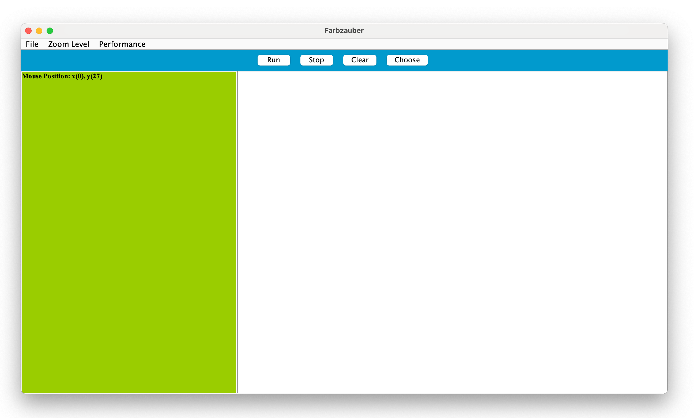

# Malen mit Methode(n) -
### eine experimentelle Einführung in die Programmierung

## 1	&nbsp;	Lernziele
In dieser Übung sollst du mittels einfacher, kleiner Schritte ein Einblick in die Programmierung, vor allem in den Aufruf und die Verwendung von Methoden, bekommen.
Dabei solltest du aktiv mit kleinen Programmen experimentieren.
Durch Ausprobieren und mithilfe deiner Kommilitonen[^1] und des Dozenten[^2] sollte am Ende ein kleines Bild dabei rauskommen.
Mit der Bearbeitung der Aufgaben sollen folgenden Fähigkeiten erlangt werden:
-   Verständnis für den Begriff 'Methoden' im Kontext der Programmierung sind und wie diese verwendet werden
-   Erzeugung, Berechnung und Darstellung von Farben auf dem Bildschirm
-   Programmierung von einfachen Berechnungen auf Zahlen und diese in einer Schleife automatisch ausführen
-   Eine Einleitung in weitere grundlegende Konzepte der Programmierung und ggf. Verwendung und Vertiefung dieser.

Dabei dieses Ziel zu erreichen kann helfen:
-  Immer langsam, je mehr man versteht, umso weniger muss auswendig gelernt werden
- Darüber reden, laut am besten mal mit dem Sitznachbar
- Notizen machen am besten mit einem Stift, nicht nur die Übungen ansehen
- Viel trinken, denn das Gehirn braucht Wasser. (Aber bitte nicht hier am Platz)

Hilft auch im normalen Unterricht und bei den Hausaufgaben

## 2	&nbsp;	Getting started

Über den Finder[^3] sollte im Verzeichnis *Programme* eine Datei namens *SwingGui.jar*, die aussieht wie eine heiße Tasse Kaffee, zu finden sein.

Wenn du diese öffnest, erscheint unsere Leinwand.

Des Weiteren benötigen man das Terminal, dass man öffnet, indem man
//todo rausfinden wie man das Terminal auf einem mac öffnet

und zum Schluss öffnet man noch die *Shapes_Main.cpp* im 
//todo editor auf mac rausfinden

und nun kann man im Terminal folgendes eingeben:

`cpp Shapes-Main.cpp -o a`

womit im selben Ordner wie die *Shapes_Main.cpp* eine Datei mit dem Namen *a.out* erscheinen sollte.

welche sich mit dem "Choose" Button unserer Leinwand öffnen lässt und uns unser erstes Bild zeichnet.

## 3	&nbsp;	Grundlagen

Wenn man nun in der *Shapes_Main.cpp* im Editor nach unten scrollt bis `int main(){` findet man folgende Aufrufe und Methoden:

    //Rechteck
    Rectangle* blau = new Rectangle(100,200,50,50,0,0,255,10);
    blau->draw();
    blau->floodFill2(125,225,0,0,255,getJPanelWidth(),getJPanelHeight());

    //Text
    StringText* stringText = new StringText(250, 0, "Hallo Welt", "Arial", 24, 1,100,0,255);
    stringText->draw();

    //Linie
    Line* rot = new Line(250, 250, 250, 150, 255, 0, 0, 10);
    rot->draw();

    //Kreis   
    Circle* gruen = new Circle(400,250,50,0,255,0,5);
    gruen->draw();
 
    //Dreieck
    Triangle* weiss = new Triangle(750, 250, 500, 150, 600, 285, 255, 255, 255, 5);
    weiss->draw();

    //Pixel
    setPixel(325,250,0,0,0);

"//" Zeigt einen Kommentar an, dieser wird von einem Programm nicht beachtet, sondern dient lediglich nur dir als Programmierer

"Rectangle* blau = new Rectangle" ruft einen sogenannten Konstruktor auf welcher für uns ein neues Rechteck mit dem Namen "blau" erstellt.

Der interessante Teil hierbei sind die Zahlen die wir als sogenannte "Parameter" dabei übergeben.
Wenn man diese Verändert, verändert sich das Rechteck. 
Probier es einfach mal aus in dem du die 200 durch eine 400 ersetzt oder eine der Nullen.
Speichere die Änderungen, keine Sorge du kannst alle Änderungen mit dem Tastenkürzel "Strg + Z" jederzeit rückgängig machen so lange du den Editor nicht schließt.
Übersetze noch einmal mit dem Terminal mit `cpp Shapes-Main.cpp -o a` und dann lass dir mit dem "Choose" Button auf der Leinwand die Änderungen zeichnen.
Sollte dir das Terminal dabei Fehlermeldungen anzeigen dann frag doch einmal den Dozenten. ;)

## 3	&nbsp;	Schleifen

Du kannst auch einmal versuchen den Kreis oder die Linie mehrmals aufzurufen,
wobei du vor allem darauf achten musst jeden neuen Kreis einen eigenen Namen zu geben zum Beispiel:

    //Kreis   
    Circle* gruen = new Circle(400,250,50,0,255,0,5);
    gruen->draw();
    Circle* gruen2 = new Circle(400,350,50,0,255,0,5);
    gruen2->draw();
    Circle* gruen3 = new Circle(400,450,50,0,255,0,5);
    gruen3->draw();

Erkennst du vielleicht schon das Problem? Was ist, wenn du 10 Kreise oder vielleicht sogar 100 neue Kreise zeichnen wolltest?

## N	&nbsp;	Glossar

[^1]: Kommilitone: Jemand mit dir zur selben Zeit zur selben Schule geht.
[^2]: Dozent: Lehrer an einer Hochschule.
[^3]: Datei Explorer nur für Mac.