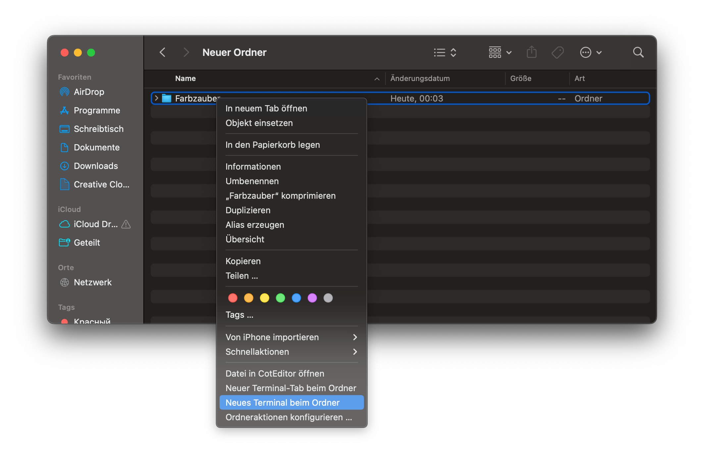
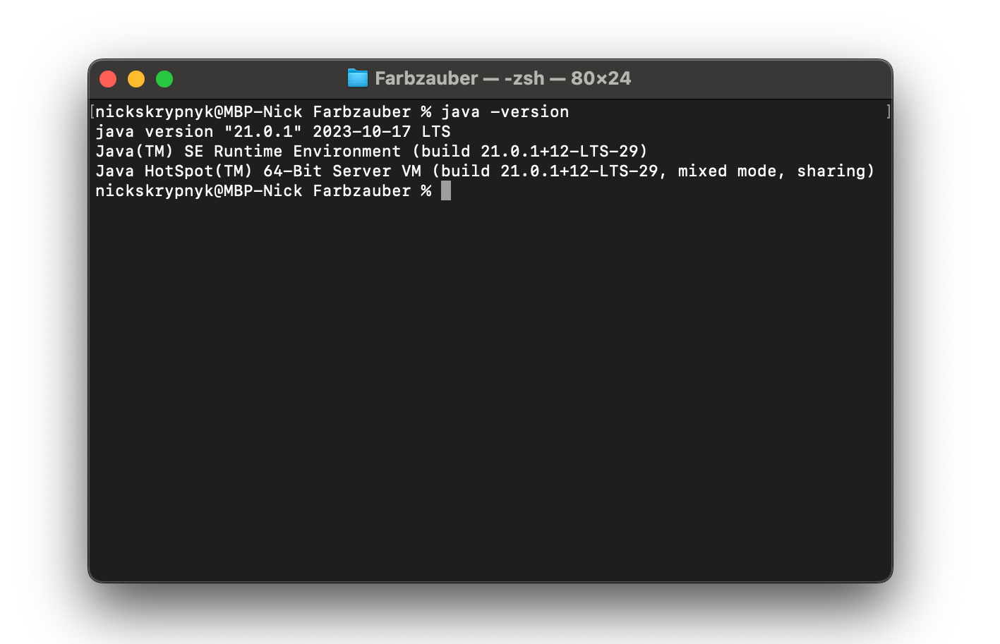
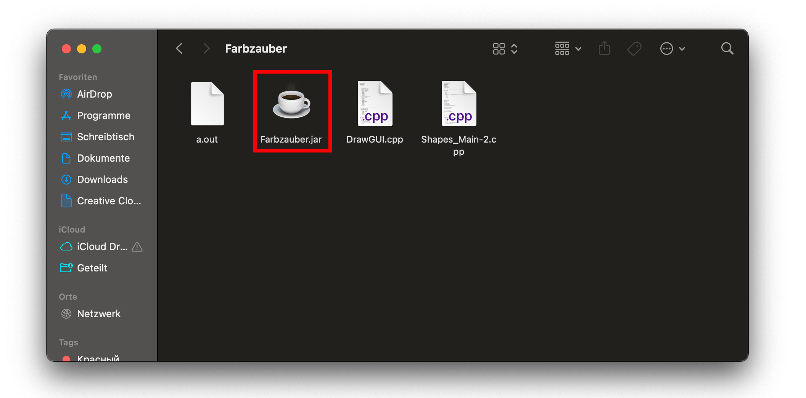
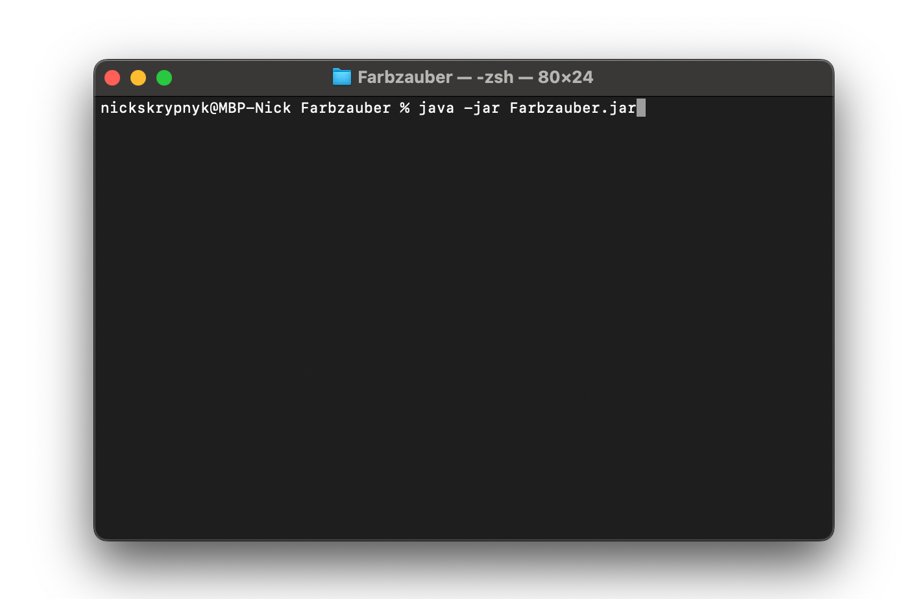
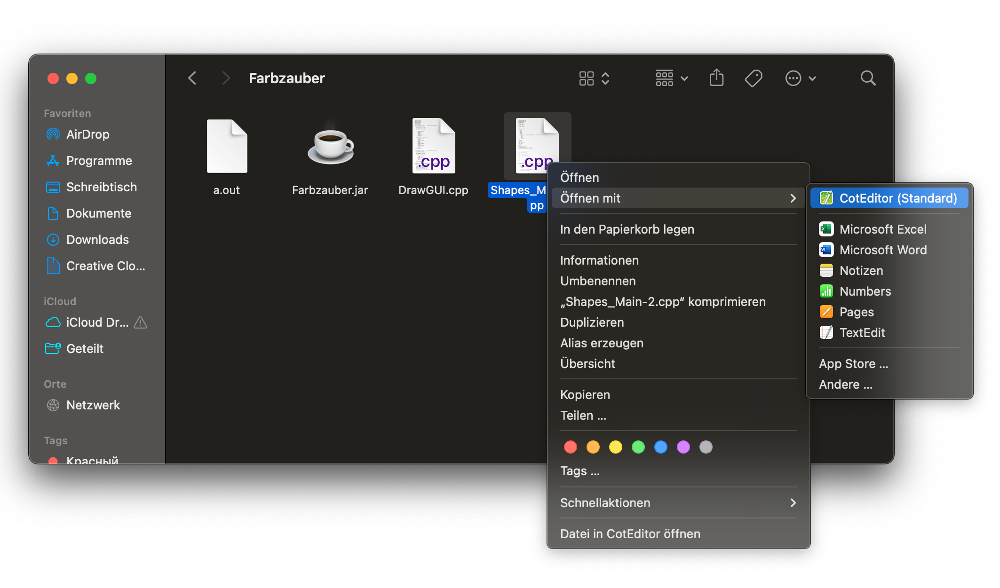

# Farbzauber und Funktionen -
### eine experimentelle Einführung in die Programmierung

## 1	&nbsp;	Lernziele
In dieser Übung sollst du mittels einfacher, kleiner Schritte ein Einblick in die Programmierung, vor allem in den Aufruf und die Verwendung von Methoden, bekommen.
Dabei solltest du aktiv mit kleinen Programmen experimentieren.
Durch Ausprobieren und mithilfe deiner Kommilitonen[^1] und des Dozenten[^2] sollte am Ende ein kleines Bild dabei rauskommen.
Mit der Bearbeitung der Aufgaben sollen folgenden Fähigkeiten erlangt werden:
-   Verständnis für den Begriff 'Methoden' im Kontext der Programmierung sind und wie diese verwendet werden
-   Erzeugung, Berechnung und Darstellung von Farben auf dem Bildschirm
-   Programmierung von einfachen Berechnungen auf Zahlen und diese in einer Schleife automatisch ausführen
-   Eine Einleitung in weitere grundlegende Konzepte der Programmierung und ggf. Verwendung und Vertiefung dieser.

Dabei dieses Ziel zu erreichen kann helfen:
- Immer langsam, je mehr man versteht, umso weniger muss auswendig gelernt werden
- Darüber reden, laut am besten mal mit dem Sitznachbar
- Notizen machen am besten mit einem Stift, nicht nur die Übungen ansehen
- Viel trinken, denn das Gehirn braucht Wasser. (Aber bitte nicht hier am Platz)

Hilft auch im normalen Unterricht und bei den Hausaufgaben

## 2	&nbsp;	Vorbereitung

Auf dem Desktop befindet sich ein Ordner namens Programmiererlebnisse, zunächst klickst du einmal mit der rechten Maustaste darauf und
wählst *Neues Terminal beim Ordner* aus






Danach öffne den Ordner und dort sollte ein Programm namens *Farbzauber.jar*, die aussieht wie eine heiße Tasse Kaffee, zu finden sein.



Wenn du diese öffnest, erscheint unsere Leinwand. Sollte dem nicht der Fall sein und du bekommst stattdessen eine Fehlermeldung,
dann starte das Programm übers Terminal mit dem Kommando `Farbzauber % java -jar Farbzauber.jar &`




und zum Schluss öffnet man noch die *Shapes_Main.cpp* im Editor in dem wir einen Rechtsklick auf die Datei machen
und dann mit der Maus über "Öffnen mit" hovern und dann in der neuen Auswahl "CotEditor" auswählen.



Hier scrollen wir einmal nach unten bis wir bei ``int main() {`` an gelangen, wo wir später auch unsere gesamte Arbeit verrichten.
Du kannst im Übrigen alles in diesem Dokument was in solchen Code-blöcken steht:
```
Hallo Welt
```
ganze einfach mit "⌘ + C" und "⌘ + V" kopieren und nun kann man im Terminal folgendes eingeben:

`clang Shapes-Main.cpp -o a`

womit im selben Ordner wie die *Shapes_Main.cpp* eine Datei mit dem Namen *a.out* erscheinen sollte.

welche sich mit dem "Choose" Button unserer Leinwand öffnen lässt und uns unser erstes Bild zeichnet.

## 3	&nbsp;	Variablen

Wie eine Box mit Namen. Man kann den Inhalt ersetzen, bearbeiten oder an verschiedenen Stellen darauf zugreifen.
Nützlich, wenn man an verschiedenen Stellen denselben Wert benötigt oder verändern möchte.

Erstellen z.B. für ganze Zahlen:
``Int zahl_1;``
``Int zahl_2;``
``Int ergebniss;``

Zahlen darin abspeichern, verändern und an mehreren Stellen verwenden:
``zahl_1 = 1;``
``zahl_2 = 3;``
```
	zahl_1 = zahl_1 + 1;
	zahl_1 += 1;
	ergebniss = zahl_1 * zahl_2;
```
Dabei ist zu beachten, dass diese Variablen nur eine bestimmte Lebensdauer haben, sprich sie existieren nur im Rahmen
von der zuletzt geöffneten geschweiften Klammer "{" bis hin wo diese wieder geschlossen wird "}"

Weitere Typen:
Float und Double für Kommazahlen.
Boolean: Ist in diesem Fall entweder 0 für FALSE oder ein anderer wert für TRUE.
Gut verwendbar für If-Abfragen. Dabei ist zu beachten, dass man für einen "ist gleich" Vergleich "==" verwendet.
```
bool nee = 0;
bool jap = 1;

if(nee == 0){
    zahl_1 -= 1;
}
```
Kurz ``if(jap) zahl_1 += 1;``

Ist zahl_1 jetzt um eins größer?

Char: Um einen einzelnen character also Buchstaben, Zeichen, Ziffern zu Speichern.
String: Ist eine verkettung von Char. Das heißt der String "Moin" besteht aus den Char 'M', 'o', 'i', 'n' in der Reihenfolge.


Arrays: Gut, wenn etwas öfter in gleicher Reihenfolge benötigt wird. Nacher werden noch Schleifen genannt z.B. die for-Schleife mit denen Arrays leicht zu verwenden sind.
```
int triangle_position_x[4];
triangle_position_x[0] = 200;
triangle_position_x[1] = 300;
triangle_position_x[2] = 340;
triangle_position_x[3] = 300;
```
Beim aufrufen nutzt man den Arraynamen(triangle_position_x) mit passendem Index([1]). dabei ist darauf zu achten das der Index bei null anfängt und nicht überschritten wird.

## 4	&nbsp;	Farben auf dem Bildschirm

Farben

Werden RGB also (Red, Green, Blue) dargestellt.
Dabei handelt es sich um Additive Farbmischung die beim Mischen von Licht angewandt wird.
In unserem fall mit drei Werten die von 0 bis 255 gehen.
Sind alle drei Werte gleich, hat man Graustufen. Dabei ist (255, 255, 255) Weiß und (0, 0, 0) Schwarz.
Ein paar Farbbeispiele wären:
Rot(255, 0, 0), Grün(0, 255, 0), Blau(0, 0, 255),
Gelb(255, 255, 0), Orange(255, 127, 0), Magenta(255, 0, 255)

Hier ein Link zum Ausprobieren:
https://informatik.schule.de/rgb/RGB_farbmischer.html

## 5	&nbsp;	Funktionen

Ähnlich wie bei Variablen sind Funktionen Programmabschnitte, die über ihren Namen mehrmals, an verschiedenen Stellen, aufrufbar sind.
Häufig werden Parameter, meist Werte, mitgegeben bzw. zurückgegeben.

Erstellen z.B. um zwei übergebene ganze Zahlen (Variablen nach dem Funktionsnamen) zu addieren und zurückzugeben(inhalt der Klammer nach return):
```
int addiere(int summand1, int summand2) {
    int summe = summand1 + summand2;
    return (summe);
}
```
Aufrufen der Funktion z.B. um ein Ergebnis der Zahlen 3 und 7 zu erhalten: </br>
``int summe = addiere(3, 7);`` </br>
Wir stellen euch schon die Funktion zum setzten eines Pixels zur verfügung.
Pixel: (position_x, position_y, rot, grün, blau)
``setPixel(2, 2, 50, 50, 50);``

Als weiteren Teil der Funktionen gibt es noch Konstruktoren. Diese funktionieren wie ein Bauplan für eigene Variablen bzw. Objekte und können mehrere Variablen und funktionen enthalten. </br>
Aufrufen eines Konstruktor z.B. für einen Kreis </br>
``Circle* circle = new Circle(0, 0, 200, 0, 0, 0, 5);`` </br>
In diesem Fall wurde ein Kreis(Circle*) der den Namen(circle) hat mit der Funktion(Circle) und den Parametern((0,0,200,0,0,0,5)) erstellt.

In diesem Fall haben wir euch einige bereitgestellt. </br>
Linie: (anfang_x, anfang_y, ende_x, ende_y, rot, grün, blau, linienbreite) </br>
``Line* line = new Line(45, 55, 25, 15, 100, 0, 255, 5);``

Dreieck: (ecke_1_x, ecke_1_y, ecke_2_x, ecke_2_y, ecke_3_x, ecke_3_y, rot, grün, blau, linienbreite) </br>
``Triangle* triangle = new Triangle(11, 11, 22, 22, 11, 22, 100, 100, 10, 5);``

Kreis: (ecke_oben_links_x, ecke_oben_links_y, radius, rot, grün, blau, liniendicke) </br>
``Circle* circle = new Circle(0, 0, 200, 0, 0, 0, 5);``

Rechteck: (ecke_oben_links_x, ecke_oben_links_y, breite, höhe, rot, grün, blau, linienbreite) </br>
``Rectangle* rectangle = new Rectangle(0, 20, 80, 30, 255, 255, 255, 5);``

Text: (ecke_oben_links_x, ecke_oben_links_y, "Hier der Text", "Schriftart", schriftgröße, 0_keines/1_dick/2_kursiv/3_beides, rot, grün, blau) </br>
``StringText* stringText = new StringText(25, 10, "Moin", "Comic Sans", 12, 1, 50, 50, 255);``

## 6	&nbsp;	Schleifen

Du kannst auch einmal versuchen den Kreis oder die Linie mehrmals aufzurufen,
wobei du vor allem darauf achten musst jeden neuen Kreis einen eigenen Namen zu geben zum Beispiel:

```
    //Kreis   
    Circle* gruen = new Circle(400,250,50,0,255,0,5);
    gruen->draw();
    Circle* gruen2 = new Circle(400,350,50,0,255,0,5);
    gruen2->fill();
    Circle* gruen3 = new Circle(400,450,50,0,255,0,5);
    gruen3->draw();
```
Erkennst du vielleicht schon das Problem? Was ist, wenn du 10 Kreise oder vielleicht sogar 100 neue Kreise zeichnen wolltest?

Für solche Fälle gibt es ein Konzept in der Programmierung namens Schleifen, es gibt vor allem Drei Varianten:

Die while-Schleife, welche stets erst eine gegebene Bedingung überprüft bevor sie ausführt:
```
while(Bedingung = wahr){
    mach etwas
}
```
Die Do-While-Schleife, welche im Gegensatz erst einmal ausführt bevor sie die gegebene Bedingung ausgeführt wird:
```
do{
    mach etwas
}while(Bedingung = wahr)
```
Und die for-Schleife welche auch die zählende Schleife genannt wird, da sie oft genutzt wird um eine Aktion eine bestimmte Anzahl von Malen auszuführen.
```
for(Startwert;Bedingung;Schrittweite){
    mach etwas
}
```
Für unsere Zwecke eignet sich vor allem die for-Schleife, weil mit dieser lässt sich der Code von oben so vereinfachen
```
for(int i = 250; i <= 450; i = i + 100){
    Circle* gruen = new Circle(400,i,50,0,255,0,5);
    gruen->draw();
    delete gruen;
}
```
Außerdem müssen wir nun auch darauf achten unser erzeugtes Objekt auch wieder zu löschen damit wir es noch einmal neu an anderer Stelle nue zu zeichnen.

## 7	&nbsp;	If-Abfragen

Aber vielleicht fällt dir ein Unterschied zwischen der vorherigen Ausgabe und jetzt auf, der mittlere Kreis ist nicht mehr ausgefüllt!
Da müssen wir wohl eine bedingte Ausnahme festlegen. Hier kommen nun sogenannte "if-Abfragen" ins Spiel.

```
if(Bedingung == wahr){
    mach etwas
}else{
    mach etwas Anderes
}
```
Man kann auch mehrere verschiedene Abfragen aufeinander stapeln welche jeweils nur ausgeführt werden, wenn die vorherigen Abfragen unerfüllt blieben.

```
if(Bedingung == wahr){
    mach etwas
}else if( Andere Bedingung == wahr){
    mach etwas Anderes
}else{
    mach etwas ganz Anderes
```
Dies erlaubt uns verschiedene Aktionen basierend auf einer Bedingung auszuführen zum Beispiel unseren mittleren Kreis zu füllen.

```
for(int i = 250; i <= 450; i = i + 100){
    Circle* gruen = new Circle(400,i,50,0,255,0,5);
    if( i == 350){
        gruen->fill();
    }else {
        gruen->draw();
    }
    delete gruen;
}
```


## 8	&nbsp;	Getting Started

Wenn man nun in der *Shapes_Main.cpp* im Editor nach unten scrollt bis `int main(){` findet man folgende Aufrufe und Methoden:

```
    //Rechteck
    Rectangle* blau = new Rectangle(100,200,50,50,0,0,255,10);
    blau->fill();
    
    //Dreick
    Triangle* weiss = new Triangle(750,250,500,150,600,250,255,255,255,10);
    weiss->draw();
      
    //Text
    StringText* stringText = new StringText(250, 0, "Hallo Welt", "Comic Sans", 24, 1,100,0,255);
    stringText->draw();

    //Linie
    Line* rot = new Line(250, 250, 250, 150, 255, 0, 0, 5);
    rot->draw();
    
    //Kreis   
    Circle* gruen = new Circle(400,250,50,0,255,0,2);
    gruen->draw();
    
    //Pixel
    setPixel(325,250,0,0,0);
```

<p>"//" Zeigt einen Kommentar an, dieser wird von einem Programm nicht beachtet, sondern dient lediglich nur dir als Programmierer</p>
<p>"Rectangle* blau = new Rectangle" ruft einen sogenannten Konstruktor auf welcher für uns ein neues Rechteck mit dem Namen "blau" erstellt.</p>
Der interessante Teil hierbei sind die Zahlen die wir als sogenannte "Parameter" dabei übergeben.
Wenn man diese Verändert, verändert sich das Rechteck. 
Probier es einfach mal aus und verändere einige der Parameter und schaue was passiert aber Achtung, einige der Werte können nicht höher als 255 gesetzt werden, welche das sind und warum klären wir später.

`blau->fill();` zeichnet dann tatsächlich das Rechteck bzw. `blau->draw();` würde dann nur den Umriss zeichnen wie du gut an dem Dreieck oder Kreis sehen kannst

Speichere die Änderungen, keine Sorge du kannst alle Änderungen mit dem Tastenkürzel "⌘ + Z"[^4] jederzeit rückgängig machen so lange du den Editor nicht schließt.
Übersetze noch einmal mit dem Terminal mit `clang Shapes-Main.cpp -o a` und dann lass dir mit dem "Choose" Button auf der Leinwand die Änderungen zeichnen.
Sollten dir dabei Fehlermeldungen anzeigen dann frag doch einmal den Dozenten.

## 9	&nbsp;	Konventionen

Zum Schluss solltest du noch ein paar Konventionen[^5] und sogenannte "good practices" also gute Gewohnheiten beim Programmieren mitnehmen von denen du auch so einige
hier schon gesehen hast

Variablennamen sollten eindeutig sein und werden meist kleingeschrieben, wobei es mehrere Möglichkeiten gibt, hier nur mal zwei.</br>
-> erhöht die Lesbarkeit und hilft beim Verständnis
```
pixelPositionY = 125;
```
oder
```
pixel_position_y = 125;
```

Code zwischen {} sollte mit der *tab* Taste stets (weiter) eingerückt werden </br>
Zudem werden geschweifte Klammern "{" bzw. "}" direkt hinter die Funktion geschrieben bzw. in dieselbe Reihe beim Schließen </br>
-> erhöht die Lesbarkeit deutlich
```
if(x == true){
    if(y == true){
        do;
    }
}    
```
Vergesse nicht Kommentare zu schreiben und achte darauf die Umlaute wie ä ö ü vermieden werden sollten </br>
-> Hilft deutlich beim Verständnis und Umlaute werden nicht von allen Texteditoren oder Entwicklungsumgebungen unterstützt 
```
//Hier koennte ihr Kommentar stehen
```
Somit solltest du eigentlich gewappnet[^6] sein das, wahrscheinlich von dem Dozenten vorgegeben Bild, gut zu zeichnen oder
deiner kreativität freien lauf zu lassen.

Viel Glück und Erfolg!

## 10	&nbsp;	Glossar

[^1]: Jemand mit dir zur selben Zeit zur selben Schule geht.
[^2]: Lehrer an einer Hochschule.
[^3]: Datei Explorer nur für Mac.
[^4]: ⌘ wird uch CMD oder Command Taste genannt.
[^5]: Regeln oder Vereinbarungen für das (soziale) Verhalten.
[^6]: Gut ausgerüstet/ausgestattet, um schwierige Situationen zu überstehen
