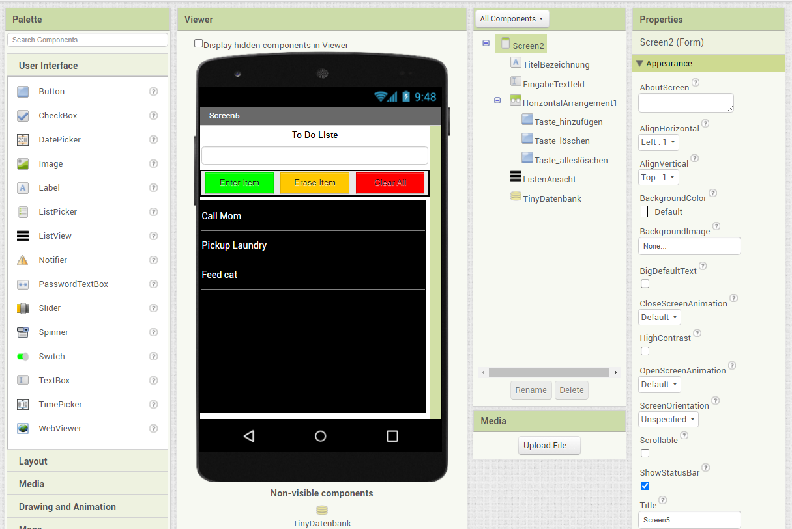

# To Do Liste mit MIT App Inventor

Szenario der Projektgruppe WS23/24 (Programmiererlebnisse) an der Hochschule Emden / Leer

### Stakeholder:

- Prof. Dr. Carsten Link
- Frederik Gosewehr, M.Eng.

### Entwicklerteam:

- Viet Hai Nguyen
- Timm Seiler

### Beschreibung

Hierbei handelt es sich um ein Szenarienpaket, in dem die Schüler und Schülerinnen sowohl grundlegende Programmierung (Bedingungen, Listen) mithilfe der visuellen Blockprogrammierungssprache "Blockly", als auch die Möglichkeit haben die visuelle Seite der UI-Entwicklung einer App, kennenzulernen. Hierzu wurden mehrere, kleine Einführungsaufgaben entworfen und mit einer Hauptaufgabe, die Umsetzung einer To Do Liste, abgeschlossen.

## Installation mit Vagrant (Virtualbox)

Eine allgemeine Anleitung findet man auf der GitHub-Repository ([hier](https://github.com/mit-cml/appinventor-sources)). Benötigt werden

- Java Development Kit (JDK) 1.8
- Apache Ant 1.10+

### MacOS

1. Virtualbox Version 7.0.14 und Vagrant installieren

2. Security Restrictions in MacOS für Virtualbox anpassen (siehe [Link](https://medium.com/@Aenon/mac-virtualbox-kernel-driver-error-df39e7e10cd8))

3. Klone die Repository mit
   	`git clone https://github.com/haifrosch/appinventor-sources-master.git`

4. Dann folgende Befehle im \appinventor-sources-master Verzeichnis ausführen

   `vagrant plugin install vagrant-vbguest 	# only once`

   `vagrant up             	# initializes the VM`
   
   Beim ersten Mal wird es einige Minuten dauern, um die Abhängigkeiten für die VM  einzurichten.

5. Um sich mit der VM zu verbinden
   	`vagrant ssh`

6. Dependencies updaten mit
   	`git submodule update --init`

7. Dann builden mit
   	`ant`

8. Und mit dem folgenden Befehl den Server starten
   	`start_appinventor`

9. Die Anwendung ist nun über `localhost:8888` erreichbar

Mit `vagrant halt` und `vagrant destroy` lässt sich die VM anhalten/löschen.

### Windows/Linux

Die Installation ist bis auf Schritt (2) identisch mit der Anleitung für MacOS. 

### Lizenz

[Apache-2.0 license](https://github.com/mit-cml/appinventor-sources/blob/master/LICENSE)