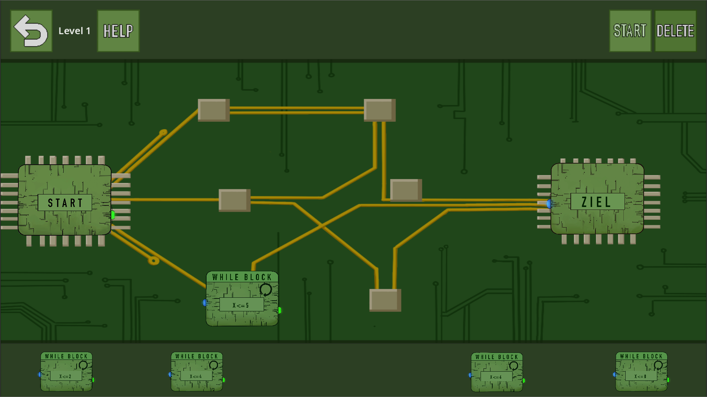

# Projektgruppe WS23/24 (Programmiererlebnisse)

## Projektteam 2D-Game mit Godot

### Stakeholder: 
- Prof. Carsten Link
### Scrum Master
- Viet Hai Nguyen (7021478)
### Product Owner
- Marcus Rosengart
### Entwicklerteam
- Torben L.
- Daniel S.
- Max H.
- Niklas S.

## Spiel zum Erlernen von Grundlagen zur Programmierun

Dieses Projekt ist im Rahmen des Moduls Projektgruppe an der Hochschule Emden/Leer entstanden.
Hierbei handelt es sich um ein Spiel, das Schülerinnen und Schülern ein grundlegendes Programmiererlebnis bietet. Es werden spielerisch durch mehrere Level grundlegende Konzepte der Programmierung im allgemeinen vermittelt.
Das gesamte Spiel basiert auf der GoDot-Engine und alle Grafiken sind in Eigenarbeit entstanden.

### Installation und Inbetriebnahme des Spiels

- Virtualbox Version 7.0.12 installieren.
- Ubuntu Version 23.04 VM in Virtualbox aufsetzen.
- Linux-Export des Spiels in Ubuntu herunterladen.
- In Ubuntu das Terminal im Zielordner öffnen.
- Das Spiel mit dem Befehl: chmod +x CodeClash.exe.sh ausführbar machen.
- Mit dem Befehl ./CodeClash.exe.sh ausführen.

### Anleitungen
Die Dokumenation des Szenarios ist im Abschnitt 2 der Datei [Dokumentation.md](./documents/Dokumentation.md) zu finden. Diese enthält neben einer Produktbeschreibung, die Dokumetation der Umsetzung und Hilfestellung für mögliche Weiterentwicklungen.  
  
Eine Anleitung für Schülerinnen und Schüler befindet sich in der Datei [schueler_pdf.md](./documents/schueler_pdf.md). Diese enthält eine Bedienungsanleitung zum Spiel sowie auch eine genauere Aufgabenbeschreibung.  
  
Die Datei [lehrer_pdf.md](./documents/lehrer_pdf.md) dient als Anleitung für Dozentinnen und Dozenten. Diese beinhaltet Anleitungen zur Installation und Inbetriebnahme des Spiels und unterstützt beim Erstellen neuer Levels. Zusätzlich enthält die Lehrer-PDF Musterlösungen für jedes Level und Hilfestellungen.

### Lizenz
Dieses Projekt ist unter der GNU General Public License lizensiert. Bitte lesen Sie die [LICENSE.md](./LICENSE.md) für weitere Details.

### Externe Linzenzen
Die folgende externe Bibliothek wurden in diesem Projekt verwendet. Die Lizenz finden Sie in der hinterlegten Lizenz-Datei:

- [GoDot](./GoDotLICENSE.txt)
